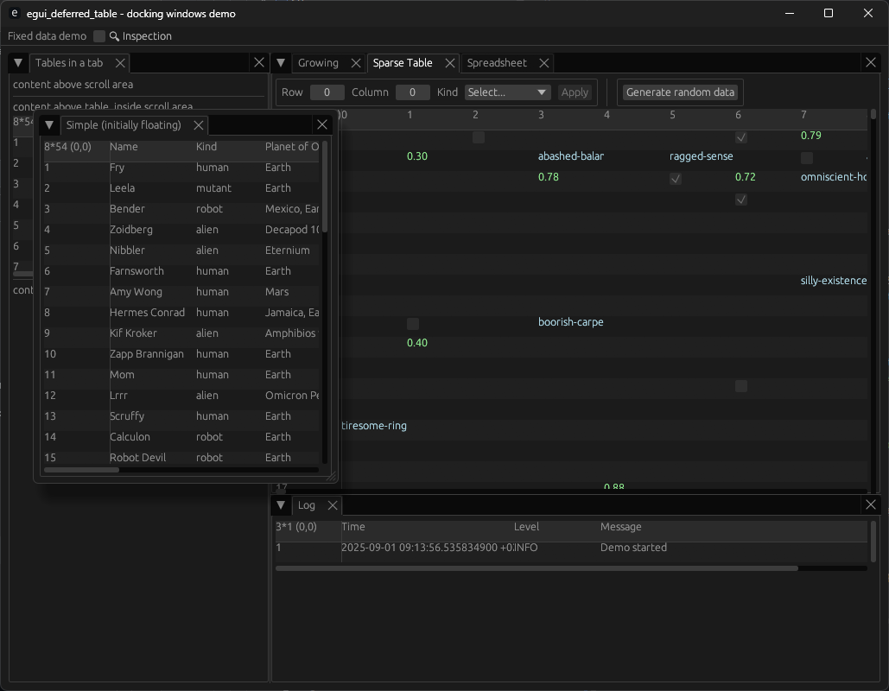

# egui_deferred_table

Another egui table system, for [comparisons](#comparisons) to other popular egui crates, see below.

Why? Existing crates either don't have all the features and/or do not perform well and/or have sub-optimal APIs for creating desktop-focussed productivity-style applications.

## Screenshot

## API

Attention is paid to defining topics of code, as below.  For most UI apps there are three distinct topics, as follows.

* [Data sources](#Data-sources) - Where the data comes from, how much of it there is, etc.
* [Actions](#Actions) - User interactions. Selection, visibility, row/column re-sizing, hiding, etc.
* [Rendering](#Rendering) - How to display the data, formatting, colors, etc.

### Data sources

egui_deferred_table has the concept of a data-source which is used to manage data retrieval, and there are blanket implementations
for various tuples. e.g. `vec![("example", 42.0_f32, true)]`.

Due to the flexible nature of data sources, you can implement your own caching/fetching/conversion functions in a way that
is suitable for your application, for instance, if the data type holds type `T` with some properties, and conversion of
properties to a display format is expensive, you can do it just-in-time as the cell is rendered, and then cache the result.
Other table systems force you to convert every value for every cell even if the cell is never rendered.

It's possible to use enums for the data source value, see the `growing` example which has a two-state enum `Loading` and `Ready(T)`
this allows UI's that can show the table at the right size and position while the data is loaded in the background.

For row/column re-ordering, you can handle it by re-ordering the columns for presentation, or you can move/change the
underlying data.  Compare the 'spreadsheet' and 'sparse' demo's handling of row/column drag/drop actions.

### Actions

When a user interacts with the table, a `vec` of `Action` is returned so that your code can handle them appropriately.

### Rendering

Rendering code is separated from data-source related code.

It's possible to use the same data-source, but with different renderers, see the 'projections' demo for an example.

### i18n support

The API is designed so that there is no embedded strings, and so that the use of i18n is not prevented or difficult when
rendering rows/columns/cells.  Indeed, there are apps using the [egui_i18n crate](https://crates.io/crates/egui-i18n) along with this crate.
If this crate ever evolves to needing strings, i18n support will be baked-in/abstracted.

## Status

This crate is work-in-progress, it aims to provide a 'batteries-included' solution that works for many different sources
of table data.

| Feature                     | Status              |
|-----------------------------|---------------------|
| Layout                      | ✅ Working           |
| Variable Row Heights        | ✅ Working via API   |
| Variable Column Widths      | ✅ Working via API   |
| Smooth scrolling            | ✅ Working           |
| Column Hiding/Row Filtering | ✅ Working via API   |
| Column re-ordering          | ✅ Working           |
| Row re-ordering             | ✅ Working           |
| Column/Row re-size handles  | ✅ Working           |
| Sorting UI                  | 🚧 Not-started (*1) |
| Filtering UI                | 🚧 Not-started (*2) |

*1 sorting can be achieved by sorting at the data source or by re-ordering rows, no built-in UI yet. 
*2 filtering works, but there's no built-in UI yet.

## Demos

See demos folder.

Demos include examples of data sources using spreadsheets, background-loaded, sparse data sources, `vec!` data sources.

Demos include simple and complex UIs, check out the 'docking' example which combines many of the other examples into a single demo
which uses `egui_dock` tabs and windows for each demo.

The 'spreadsheet' demo is a working spreadsheet, with formulas and cell re-calculation.

## License

Available under APACHE *or* MIT licenses.

* [APACHE](LICENSE-APACHE)
* [MIT](LICENSE-MIT)

## Authors

* Dominic Clifton - Project founder and primary maintainer.

## Changelog

Possible log types:

- `[added]` for new features.
- `[changed]` for changes in existing functionality.
- `[deprecated]` for once-stable features removed in upcoming releases.
- `[removed]` for deprecated features removed in this release.
- `[fixed]` for any bug fixes.
- `[security]` to invite users to upgrade in case of vulnerabilities.

For API migration details, see the git commit history and study the changes made to the demos.

### 0.1.6 (2025/10/22)

- [added] Row selection.  See `Action::RowSelectionChanged`.
- [added] Edit-in-place API.  See `EditableTableRenderer` and `DeferredTable::show_and_edit`.
- [changed] Updated spreadsheet example to have edit-in-place cells. 
- [changed] Added a 'shrink' button to the 'growing' example; this allows us to see the behavior of deleting selected
  rows and see that newly added rows are not selected.
- [fixed] incorrect table size when the data source dimensions were made smaller.

### 0.1.5 (2025/09/21)

- [changed] Remove the `DeferredTableBuilder` in favor of a solution that allows caching of the column parameters on an 
  as-required basis so they do not have to be built every frame.
- [added] Support for row parameters in addition to column parameters.
- [changed] Move some methods from the `DeferredTableDataSource` to `DeferredTableRender`.  This allows multiple projections
  (aka 'views') of the same data source using different renderers.  See the new 'projections' example.
- [changed] each cell has a consistent ID based on the cell kind and any applicable mapped row/column index.

### 0.1.4 (2025/09/10)

- [fixed] Fix panic when column constraints are not specified for a column.
- [changed] Hovered cell is not highlighted by default. New API methods are available to enable it.

### 0.1.3 (2025/09/10)

- [added] Column constraints (min/max/resizable).

### 0.1.2 (2025/09/09)

- [added] Support row/column resizing.
- [changed] Improved pixel rendering.

### 0.1.1 (2025/09/05)

- [added] Support row/column filtering.
- [added] Support row/column re-ordering.

### 0.1.0 (2025/09/01)

First release

First release

# Comparisons

| Crate                                                                              | Table Grid Renderer     | Notes                                            | Auto-size | Selection       | Hiding Columns | Sorting    | Filtering Rows | Resizable rows | Resizable columns | Variable amount of columns/rows | Reordering Columns | Reordering rows | Performance with 1,000's of rows | API notes                    |
|------------------------------------------------------------------------------------|-------------------------|--------------------------------------------------|-----------|-----------------|----------------|------------|----------------|----------------|-------------------|---------------------------------|--------------------|-----------------|----------------------------------|------------------------------|
| [`egui_deferred_table`](https://github.com/makerpnp/egui_deferred_table)           | Own                     | Work-in-progress                                 | No        | 🚧 Planned (*8) | ✅ Yes          | 🚧 Planned | ✅ Yes          | ✅ Yes          | ✅ Yes             | ✅ Yes                           | ✅ Yes              | ✅ Yes           | ✅ excellent                      | Very flexible                |
| [`egui_table`](https://github.com/rerun-io/egui_table)                             | Own                     | egui_table has a "batteries not included" design | ✅ (*1)    | ❌ No            | ❌ No           | ❌ No       | ❌ No           | ❌ No           | ✅ Yes             | ✅ Yes                           | ❌ No               | ❌ No            | ✅ excellent                      | Flexible                     |
| [`egui_extras::Table`](https://github.com/emilk/egui/tree/main/crates/egui_extras) | Own                     |                                                  | ✅ (*1)    | ❌ No            | ❌ No           | ❌ No       | ❌ No           | ❌ No           | ✅ Yes             | ❗ Yes (*2)                      | ❌ No               | ❌ No            | ✅ good                           | Rigid, unforgiving           |
| [`egui-selectable-table`](https://crates.io/crates/egui-selectable-table)          | egui_extras::Table (*7) |                                                  | ✅ (*1)    | ✅ Yes           | ❌ No           | ✅ Yes      | ❗ (*3)         | ❌ No           | ✅ Yes             | ❗ Yes (*2)                      | ❌ No               | ❌ No            | ✅ good                           | Rigid, unforgiving           |           
| [`egui-data-table`](https://crates.io/crates/egui-data-table)                      | egui_extras::Table (*7) | Comprehensive, but limited.                      | ✅ (*1)    | ✅ Yes           | ✅ Yes          | ✅ Yes      | ❗ (*3)         | ❌ No           | ✅ Yes             | ❗ Yes (*4)                      | ✅ Yes              | ❌ No            | ❗ poor (*5)                      | Very rigid, hard-to-use (*6) |

1) Works only when every cell has been rendered - no-up front checking of every cell's width height.  e.g. on the first 
   frame, the rendered cells are used to calculate the column widths, but when the user scrolls down to a wider row the column width
   will not be correct.  The *only* case where the column width is correct is when the first frame renders the widest cell, this leads
   to a bad UX.
2) requires `column` to be called at runtime for each column, conditional code in the table definition required to support variable amount of columns, must be paired
   with equal amount of calls to `header.col`, usually requiring repeating the conditional logic.
3) Only at the API level.
4) Somewhat difficult to achieve at run-time due to the API without extreme care. The examples use many magic numbers and switch statements when handling columns. 
5) Very slow with a data set of ~1000 rows and 13 columns, often requiring lots of up-front conversion to the type used by the rows.
6) The `RowViewer` trait in the API mixes many concerns in a 'garbage-bin' style API which attempts to do everything: presentation, copy/paste, insertion/deletion, filtering, hotkeys, events.
   This leads to you having to implement or work-around features that you do not need/use/want.  It also mixes presentation with business-logic.  e.g. your cell rendering code is
   defined in the same trait impl that also selection changes and data deletion.  No clear separation between user interactions and rendering.
7) Since the underlying table grid system and row/column sizing is `egui_extras::Table`, it suffers from all the same issues as `egui_extra::Table`
8) Supports click events.

* The author of this crate has evaluated and used all the above crates in large desktop-style productivity apps.

If there are any errors in the above table, please create an issue or PR.

## Timeline

2025/08/13 - Crate created!

## Links

* Patreon: https://www.patreon.com/MakerPnP
* Github: https://github.com/MakerPnP
* Discord: https://discord.gg/ffwj5rKZuf
* YouTube: https://www.youtube.com/@MakerPnP
* X/Twitter: https://x.com/MakerPicknPlace

## Contributing

If you'd like to contribute, please raise an issue or a PR on the github issue tracker, work-in-progress PRs are fine
to let us know you're working on something, and/or visit the discord server.  See the  section above.
